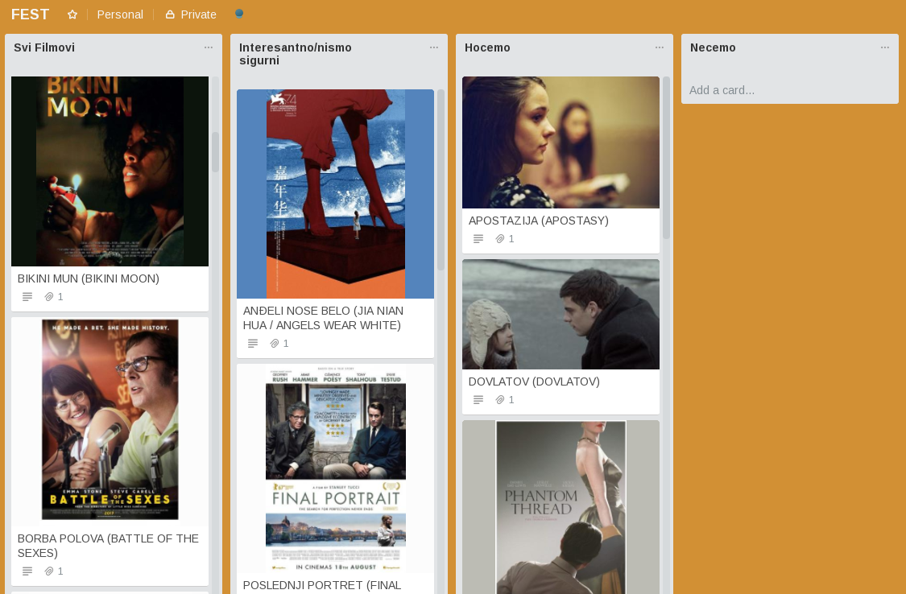

# Festrel - Imports FEST.rs movies to Trello

I visit [Fest](https://www.fest.rs/Naslovna) every year, and although their site does gets better all the time, picking movies is still very hard. This time I decided to do a quick hack to import movies to Trello, and do all the planning there.



## Running

You will need python3, and all the libraries from `requirements.txt` installed.

Since this is just a hack (seriously, just look at that code!), I didn't really spend much time integrating Trello properly. I just took the keys from https://trello.com/app-key and copied the `board_id` from URL. (When you open a board it's in `https://trello.com/b/{board_id}/{board_name}`.)

If you want to use this, do the same and copy the info into `settings.py` using the following format:

```
api_key = ''
api_secret = ''
token = ''

board_id = ''

language = 'en'
```

For language, pick either `'en'` or `'sr'`.

Once you have all of that set up, just run

```
./festrel.py
```
